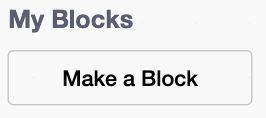
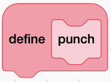

## Make a punch block

The starter project is open beside these instructions, with the fighter's animation costumes and sounds ready to use.

Click on the `player` sprite.

Click the `Costumes`{:class="block3looks"} tab and find `punch_01` to `punch_06`. These costumes make up one punch.

Go back to the `Code`{:class="block3control"} tab. Open `My Blocks`{:class="block3custom"} and click **Make a Block**.

Name the block `punch`{:class="block3custom"} and click **OK**.

A `define punch`{:class="block3custom"} block appears in the Code area.

A block you make yourself can run a group of blocks with one instruction. This is called **abstraction**.

You'll add the punch animation to this block next.
