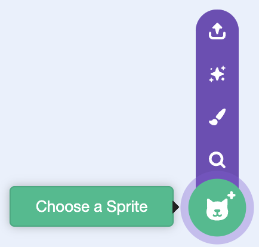
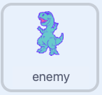

## Add an enemy

Add an enemy that will appear from both sides of the Stage.

Hover over **Choose a Sprite** and choose an enemy with several costumes so it can animate as it moves. The example uses a dinosaur.



Rename the new sprite `enemy`.



Add a green flag script. Hide the original sprite, move it to the right edge, set its rotation style, and choose a size that fits the Stage.

```blocks3
when green flag clicked
hide
go to x: (280) y: (0)
set rotation style [left-right v]
set size to (70) %
```

Change the size if your enemy looks too big or too small.

The original enemy stays hidden because the game will use clones of it.
