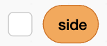

## Choose a spawn side

Randomly choose whether each enemy will come from the left or the right.

<h2 class="c-project-heading--explainer">What you need to do</h2>


Make a variable called `side`{:class="block3variables"}, **For all sprites**. Untick its checkbox so it does not appear on the Stage.



On the `enemy` sprite, add a `when I receive ()`{:class="block3events"} block. Make a new message called `dino`.

While the game is running, pick a random side — `1` or `2` — once a second.

```blocks3
when I receive (dino v)
repeat until <(playing) = (0)>
set [side v] to (pick random (1) to (2))
wait (1) seconds
end
```

## Now run your code

You'll use the number in `side`{:class="block3variables"} to place a clone next.
