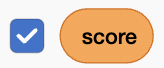

## Keep score

Score one point for every second the fighter survives and remember the best run.


Make two variables, `score`{:class="block3variables"} and `high score`{:class="block3variables"}, both **For all sprites**. Tick both checkboxes so the player can see them.




## Step 1

Click on the `Stage` and reset the score when the green flag is clicked.

```blocks3
when green flag clicked
set [score v] to (0)
```

## Step 2

Add one point per second while the game is running.

After each one-second wait, check that `playing`{:class="block3variables"} is still `1` before adding the point. This stops the score changing after the game ends.

When the game ends, save the score as the new high score if it is higher than the old one.

```blocks3
when I receive (dino v)
repeat until <(playing) = (0)>
wait (1) seconds
+if <(playing) = (1)> then
change [score v] by (1)
end
end
if <(score) > (high score)> then
set [high score v] to (score)
end
```

## Now run your code

Play two rounds. The score climbs each second and the best score stays on the Stage.
