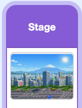

## Set the scene and save

Finish your game by choosing how Tokyo looks.

<h2 class="c-project-heading--explainer">What you need to do</h2>

Click on the `Stage`, then the `Backdrops`{:class="block3looks"} tab.

Choose the day, sunset, or night version of Tokyo.

If you want, change the `game over`{:class="block3custom"} block on the `player` sprite so the fighter says the final `score`{:class="block3variables"}.

## Now run your code

Play a full round. Check that the score climbs, hits knock enemies away, bites remove health, and the game ends when health reaches zero.

Save your project so you don't lose your work.

