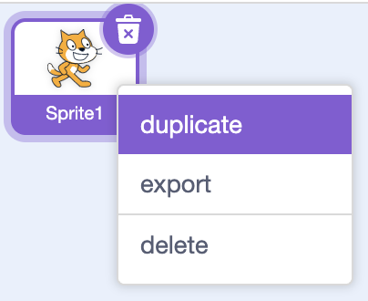

## Make it your own

You've finished Stickman battle — now make it your own!

<h2 class="c-project-heading--explainer">What you need to do</h2>

You don't have to try every idea. Pick the changes that sound the most fun.

## Step 1

### Change the difficulty

Can you make a `difficulty`{:class="block3variables"} variable that controls how often enemies appear?

Divide the delay between clones by `difficulty`{:class="block3variables"}. A larger value creates enemies more often.

```blocks3
wait ((1) / (difficulty)) seconds
```

Set `difficulty`{:class="block3variables"} to a sensible value, such as `2`, once. A value of `2` creates an enemy every half second; `4` creates one every quarter second.

Tick the variable, then right-click its display on the Stage and choose **slider**. The player can choose the difficulty before or during a round, and the green flag will not overwrite their choice.


Play-test different values and choose one that feels challenging but fair.

## Step 2

### Build a two-player battle

Turn Stickman battle into a game for two players, with one fighter each.

- Duplicate the `player` sprite so the second fighter starts with the same costumes, sounds, and scripts.
- Recolour one fighter's punch, kick, and slash costumes. Give each fighter a different strike colour.
- When the green flag is clicked, start the fighters on opposite sides of the Stage and point them towards each other.
- Make each fighter sense the other fighter's strike colour. Keep both strike colours out of the backdrop so only attacks count as hits.
- Delete the `enemy` sprite, then give the second fighter different controls and its own health.
- Add a way for one fighter to win when the other's health reaches zero.



## Now run your code

Change one thing at a time and test after every change.

Remember to save your project.
