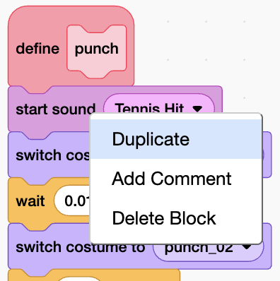

## Animate a kick

Build the kick quickly by copying the punch and changing the costumes.


Make a new block called `kick`{:class="block3custom"}.

Right-click the first block under `define punch`{:class="block3custom"}, choose **Duplicate**, and drop the copied stack under `define kick`{:class="block3custom"}.



Change the copied blocks to use the **Suction Cup** sound and the kick costumes. Remove extra blocks until the script matches this one:

```blocks3
define kick
start sound (Suction Cup v)
switch costume to (kick_01 v)
wait (0.01) seconds
switch costume to (kick_02 v)
wait (0.01) seconds
switch costume to (kick_03 v)
wait (0.01) seconds
switch costume to (kick_04 v)
wait (0.01) seconds
switch costume to (kick_05 v)
wait (0.01) seconds
switch costume to (kick_03 v)
wait (0.01) seconds
switch costume to (kick_06 v)
wait (0.02) seconds
```

Add a `when m key pressed`{:class="block3events"} script to run the kick.

```blocks3
when [m v] key pressed
kick :: custom
```

## Now run your code

Press `m`{:class="block3sensing"}. Your fighter kicks.
